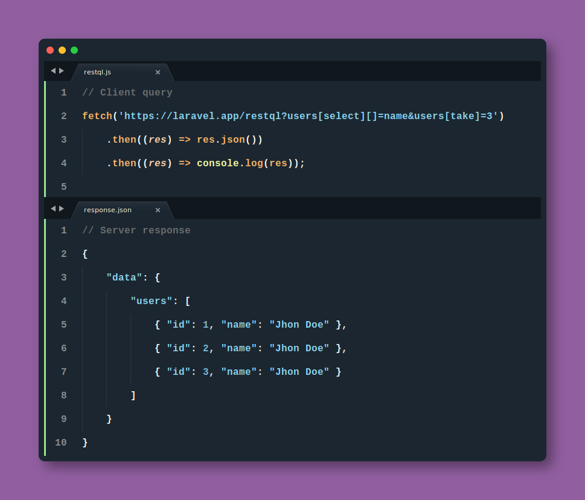

# RestQL

[](//packagist.org/packages/gregorip02/restql)
[](//packagist.org/packages/gregorip02/restql)
[](//packagist.org/packages/gregorip02/restql)
[](https://github.com/gregorip02/restql/actions)

RestQL is a Laravel eloquent-based data resolution package. This package tries to adopt **GraphQL** principles solving only the data that the client requests. RestQL uses your **Laravel** models as an entry point to add queries to then based in the eloquent methods. 

**Please see the [documentation](https://github.com/gregorip02/restql/wiki).**



## **Why?**

Imagine you have an application that manages authors, these authors can publish articles and those articles can have comments from different authors. You have a web client, for example, that uses **fetch** to consume the data offered by your service and somewhere in your code, you need a list of the **author's names only**.

They wear something like that.

```js
fetch('https://laravel.app/api/authors')
  .then((res) => res.json())
  .then(({ data }) => console.log(data.authors));
```

So, you have a route like this.

`routes/api.php`

```php
<?php

use App\Author;
use Illuminate\Http\Request;

Route::get('/authors', function (Request $request) {
  $authors = Author::take(25)->get();

  return ['data' => compact('authors')];
});
```

Most likely you will use a controller, then use the author model and query the data.
Finally you would have a response similar to this.

```javascript
{
    "data": {
        "authors": [
            {
                "id": 1,
                "name": "Lazaro Kohler",
                "email": "greenfelder.jenifer@example.org",
                "email_verified_at": "2020-03-19T18:11:36.000000Z",
                "created_at": "2020-03-19T18:11:36.000000Z",
                "updated_at": "2020-03-19T18:11:36.000000Z"
              },
              {
                "id": 2,
                "name": "Miss Anastasia Klocko DVM",
                "email": "lemke.trinity@example.org",
                "email_verified_at": "2020-03-19T18:11:36.000000Z",
                "created_at": "2020-03-19T18:11:36.000000Z",
                "updated_at": "2020-03-19T18:11:36.000000Z"
              },
              { /* 23 more authors */ }
        ]
    }
}
```

But what if you only need a **author's names** collection for example? Imagine that your application becomes huge and your user model handles a large number of attributes.

## **Get started**

Install RestQL using composer.

```bash
composer require gregorip02/restql
```

Publish the package configuration.

```bash
php artisan restql:schema
```

Add the `RestqlAttributes` trait to your eloquent models.

> **2.2** This is recomended because you can determine the selectable attributes with `onSelectFillable`.

```php
<?php

use Illuminate\Database\Eloquent\Model;
use Restql\Traits\RestqlAttributes;

class Author extends Model
{
    use RestqlAttributes;

    // ...
}
```

Generate an `authorizer` for your `App\Models\Author` model.

```bash
php artisan restql:authorizer AuthorAuthorizer
```

This creates a new class in the namespace `App\Restql\Authorizers\AuthorAuthorizer` like the following.

```php
<?php

namespace App\Restql\Authorizers;

use Restql\Authorizer;

final class AuthorAuthorizer extends Authorizer
{
    // ...
}
```

Then add the available HTTP methods to your authorizer as follows.

```php
<?php

namespace App\Restql\Authorizers;

use Restql\Authorizer;

final class AuthorAuthorizer extends Authorizer
{
    /**
     * Can get one or more author resources.
     *
     * @param  array $clausules
     * @return bool
     */
    public static function get(array $clausules = []): bool
    {
        // You could replace this with permission checks or validations.
        return true;
    }
}
```

Then, set your schema definition.

> Since version 2.x of this package the configuration has been updated to increase flexibility and internal behavior modification.

You must define your entire schema in the config file, RestQL will then interpret it and execute the queries based on this file. With this there is a possibility that you can remove internal functions, modify them or even create your own implementations. See <a href="https://github.com/gregorip02/restql/wiki/Install#schema-definition">Schema definition.</a>

`config/restql.php`

```php
<?php

use App\Models\Author;
use App\Restql\Authorizers\AuthorAuthorizer;

return [
    // ...

    'schema' => [
        'authors' => [
           'class'  => Author::class,
           'authorizer' => AuthorAuthorizer::class,
           'middlewares' => []
        ]
    ],

    // ...
];
```

The developer must specify the return type of the relationships defined in the eloquent model. **You should set the return type of your associative methods** (relationships). For example.

`app/Models/Author.php`

```php
<?php

namespace App\Models;

use Illuminate\Database\Eloquent\Model;
use Illuminate\Database\Eloquent\Relations\HasMany;

class Author extends Model
{
    /**
     * Get the author articles.
     *
     * @return \Illuminate\Database\Eloquent\Relations\HasMany
     */
    public function articles(): {} // Bad
    public function articles(): HasMany {} // Good
}
```

Configure your endpoint.

`routes/api.php`

```php
<?php

use Restql\Restql;
use Illuminate\Http\Request;

Route::get('/restql', fn (Request $request) => Restql::resolve($request));
```

## **Refactor time**

Now, you can re-factor your client's code so that it sends a parameter in the request with the data it needs, in this case a collection of author names. They wear something like that.

```js
const { stringify } = require('qs');

// Define your queries.
const getAuthorsQuery = {
    authors: {
        select: ['name']
    }
};

// Consume the restql endpoint.
fetch(`https://laravel.app/restql?${stringify(getAuthorsQuery)}`)
    .then((res) => res.json())
    .then((res) => console.log(res));
```

The parameters of the query should be a parsed objects that defines the clauses accepted by your schema definition. For your web clients **we recommend [qs](https://www.npmjs.com/package/qs).** Instead of having a long JSON response with unnecessary data, you would get something like this.

```javascript
{
  "data": {
    "authors": [
        { "id": 1, "name": "Kasey Yost" },
        { "id": 2, "name": "Ike Barton" },
        { "id": 3, "name": "Emie Daniel" },
        { /* 22 more authors */ }
      ]
  }
}
```

Likewise, this will considerably optimize your queries to the database management system. In this case, it will run just a `select id, name from authors` for example.


## **The good parts**

So, let's say you now have a requirement in your application that tells you to have the `id` and `title` of the last **two** articles published by each author.

```js
const { stringify } = require('qs');

// Define your queries.
const getAuthorsAndTwoLatestArticlesQuery = {
    authors: {
        select: ['name'],
        with: {
            articles: {
                take: 2
                select: 'title',
                sort: {
                    column: 'published_at',
                    direction: 'desc'
                },
            }
        }
    }
};

// Consume the restql endpoint.
fetch(`https://laravel.app/restql?${stringify(getAuthorsAndTwoLatestArticlesQuery)}`)
    .then((res) => res.json())
    .then((res) => console.log(res));
```

You wold get a response like this.

```json
{
  "data": {
    "authors": [
        {
            "id": 1,
            "name": "Kasey Yost",
            "articles": [
                {
                    "id": 3434,
                	"title": "My awesome article"
                }
            ]
        },
        { /* 24 more authors */ }
      ]
  }
}
```


## **How it works**

Basically, RestQL filters the keys of the models received in the HTTP request and compares them with the keys of the user configuration. These keys represent a specific eloquent model. The values of these keys are eloquent clauses (methods) accepted by RestQL and the arguments of these clauses are sent as values.

For example, if a params like the following is sent in the request.

```javascript
{
  "authors": {
    "select": "name",
    "with": {
      "articles": {
        "select": "title"
      }
    }
  }
}
```

RestQL will interpret this as the following.

```php
<?php

// Assuming that the parent model we want to obtain is the author's data.
// The variable $query represents the query constructor of the parent model,
// in this example, the Author model.
$query->select(['name'])->with([
  'articles' => static function (Relation $relation) {
    $relation->select(['title']);
  }
]);
```

You can read more about the RestQL Clausules <a href="https://github.com/gregorip02/restql/wiki/Clausules"
                                                title="RestQL Documentation">here</a>.

# **What's next?**

Are you interested on contrib to this project? see the <a href="./NEXT.md"
                                                         title="Next features">NEXT.md</a> file.

# **Contributing**

Thanks for consider contrib to this project, please see the development docs at this
<a href="https://github.com/gregorip02/restql/wiki/Development">page</a>.

# **Please support it**

This is a personal project that can be very useful, if you believe it, help me
develop new functionalities and create a pull request, I will be happy to review
and add it. So, You can also contribute to the team by buying a coffee.

<a href="https://www.buymeacoffee.com/BgHiZ9b" target="_blank">
    
</a>
