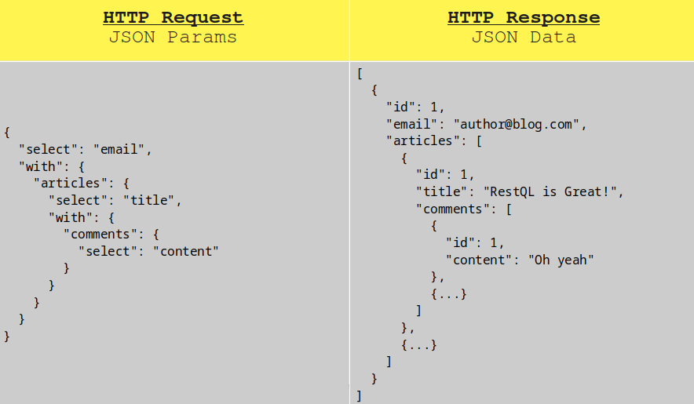

# RestQL

RestQL is a Laravel eloquent-based data resolution package. This library tries to
adopt GraphQL principles solving only the data that the client requests. RestQL uses
the eloquent clauses as an entry point to add queries to the constructor that can then
be obtained by the user using the `get` or` paginate` method.



# Why?

Imagine you have an application that manages authors, these authors can publish
articles and those articles can have comments from different authors.

You have a web client, for example, that uses axios to consume the data offered
by your service. Somewhere in your code, you need a list of the **author's names only**.

They wear something like that.

```js
axios.get('http://laravel.app/api/authors').then(({ data }) => {
    // Do something...
    console.log(data)
});
```

So, you have a route like this.

```php
// api.php
<?php

// Get all the authors using your typical laravel implementation.
Route::get('authors', function (Request $request, Author $author) {
    // Do something...
    return $authors->all();
});
```

Most likely you will use a controller and then use the author model and query the data.
Then you would have a response similar to this.

```js
[
    {
      "id": 1,
      "name": "Lazaro Kohler",
      "email": "greenfelder.jenifer@example.org",
      "email_verified_at": "2020-03-19T18:11:36.000000Z",
      "created_at": "2020-03-19T18:11:36.000000Z",
      "updated_at": "2020-03-19T18:11:36.000000Z"
    },
    {
      "id": 2,
      "name": "Miss Anastasia Klocko DVM",
      "email": "lemke.trinity@example.org",
      "email_verified_at": "2020-03-19T18:11:36.000000Z",
      "created_at": "2020-03-19T18:11:36.000000Z",
      "updated_at": "2020-03-19T18:11:36.000000Z"
    },
    {...}
]
```

But what if you only need the name of the author? Imagine that your application
becomes huge and your user model handles a large number of attributes. This is where
data resolution packages come into play.

# Data Resolution Packages

Data resolution packages are the way to optimize queries and responses based on
parameters received from the client. Fortunately, Laravel has a powerful ORM and makes
this implementation extremely compatible. Let's see how to do it using the RestQL package.

### Define your endpoint

You can continue using multiple endpoints, you could also define a single endpoint
for your queries, but now let's see an example similar to the one shown above.

```php
// api.php
<?php

// Get all the authors using data resolution package.
Route::get('authors', function (Request $request, Author $author) {
    // The resolve method is available on your model
    // using the RestQL Resolve trait.
    return $author->resolve($request)->get();
});
```

Now, you can re-factor your client's code so that it sends a parameter in the
request with the data it needs, in this case a list of author names. They wear
something like that.

The parameters of the query can be a json object that defines the clauses accepted
by RestQL, or you can encode this JSON in base64 if you want your URL to
appear "more secure".

```js
// This is an example using the request parameters directly.
axios.get('http://laravel.app/api/authors', {
    params: {
        select: 'name'
    }
}).then(({ data }) => {
    // Do something...
    console.log(data)
});

// This is an example using the base64 encoded request parameters.
const toBase64(string) = () => new Buffer.from(string).toString('base64');
axios.get('http://laravel.app/api/authors', {
    params: {
        query: toBase64(JSON.stringify({
            select: 'name'
        })) // eyJzZWxlY3QiOiJuYW1lIn0=
    }
}).then(({ data }) => {
    // Do something...
    console.log(data)
});
```

Instead of having a long JSON response with unnecessary data, you would get
something like this. Likewise, this will considerably optimize your queries to
the database management system. In this case, it will run just a
`select id, name from authors` for example.


```js
[
    {
      "id": 1,
      "name": "Lazaro Kohler",
    },
    {
      "id": 2,
      "name": "Miss Anastasia Klocko DVM",
    },
    {...}
]
```

## Please support it

This is a personal project that can be very useful, if you believe it, help me
develop new functionalities and create a pull request, I will be happy to review
and add it. So, You can also contribute to the team by buying a coffee.

<a href="https://www.buymeacoffee.com/BgHiZ9b" target="_blank">
    
</a>
